# Run Book

## Create Gateway subnet in vnet and make sure gatewat subnet used for launch-VMS
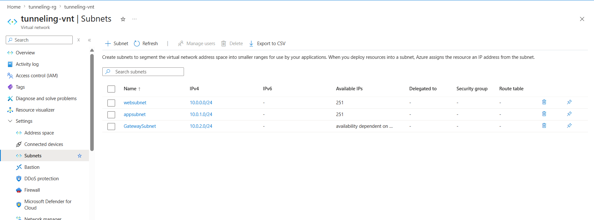

## In Azure Create virtual network gateway & Public IP for configuring with the aws customer gateway
<!-- 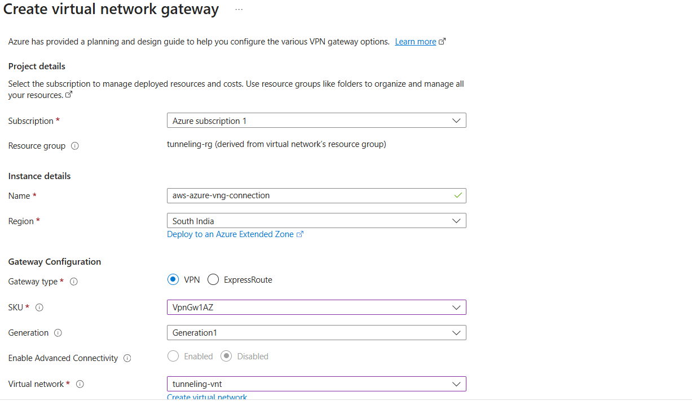 -->

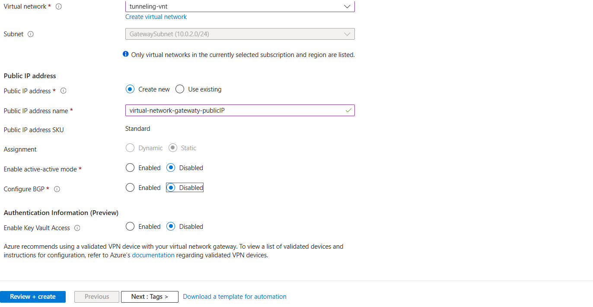

## In AWS Create Virtual private gateways in AWS and attach the vpc.
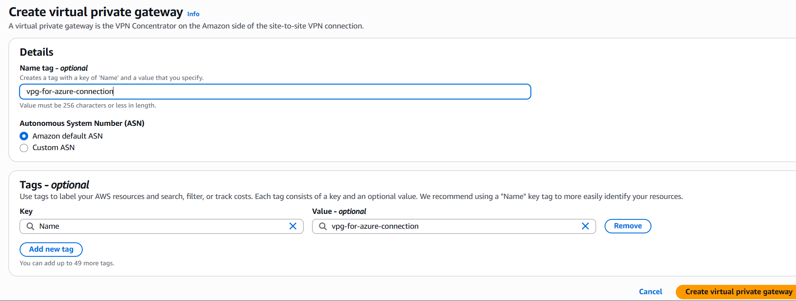

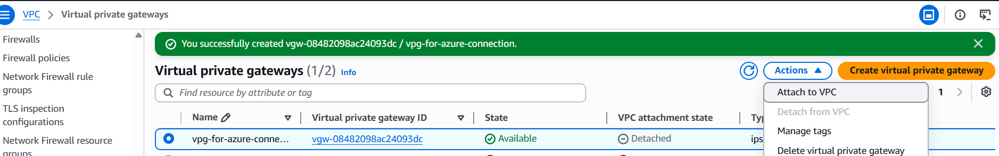

## In AWS  Create customer gateway  and allow the azure virtual network gateway public ip in the customer gatewat IP address field.
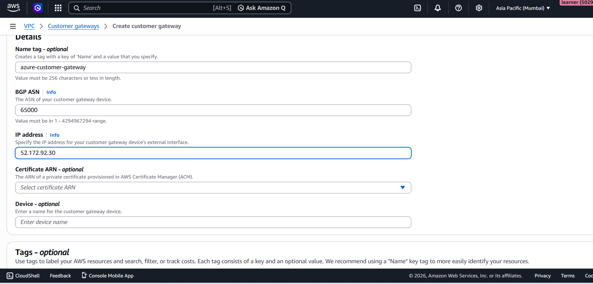

## In AWS Create VPN connection and associate the customergateway,virtual private gateway.
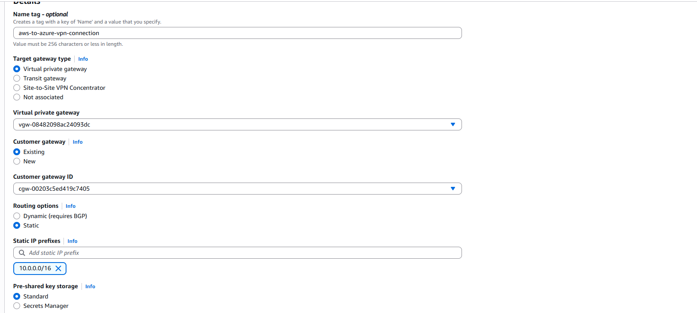


```bash
    Note:-
    Inthe static ip field mention the azure vnet-cidr Range
```

## In AWS Edit the route table & the Azure Vnet Cide Range & AWS virtual private gateway.
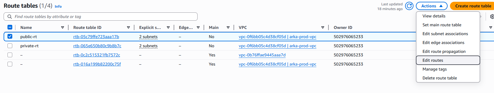
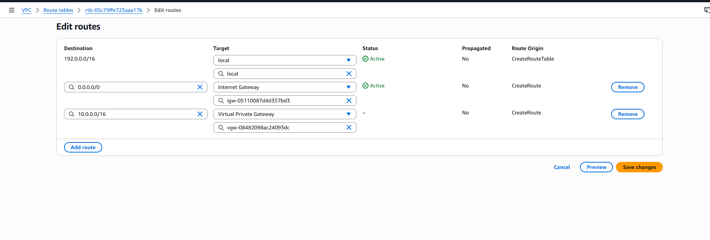

## In Azure Create Local network gateway
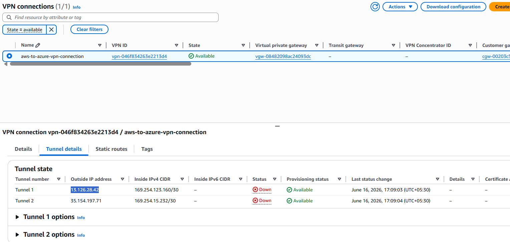

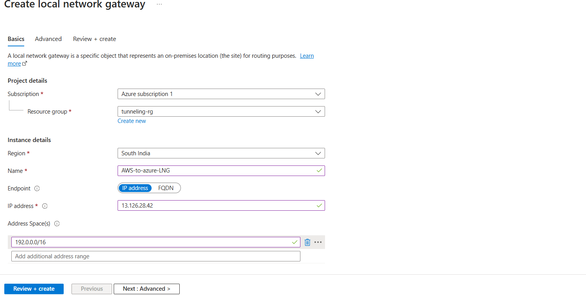

Note :-
```bash
    In Azure LNG - Address Space(s) Mention the AWS VPC Cidr Range
    In Azure LNG - IP address Mention the AWS VPN-OutsideIP
```
## In Azure Add the Connection(LNG) inthe azure virtaul network gateway 

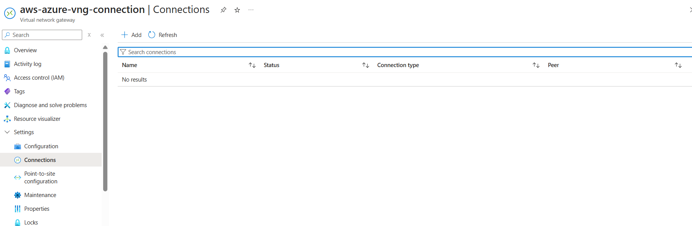

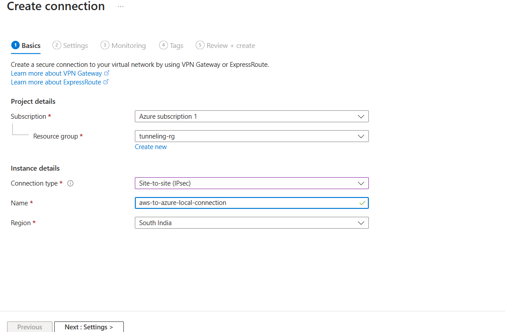

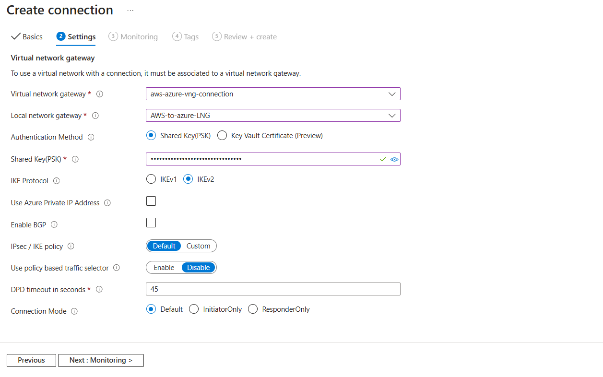

```bash
    01) Attach the Virtual network gateway & Local network gateway & Shared Key(PSK) = MyAzureAWS123 or else v6FqOZJQGjoRQNZJyVS848Gb81paF_SS
    2) You can take  from the site-site-vpn by modify vpn tunnel options and select the outside vpn tunnel ip and look for Pre-shared key and pass it inthe azure connection Pre-shared key.
    3) When you are copying the preshared key from the aws dont modify anything , just copy the key.
```

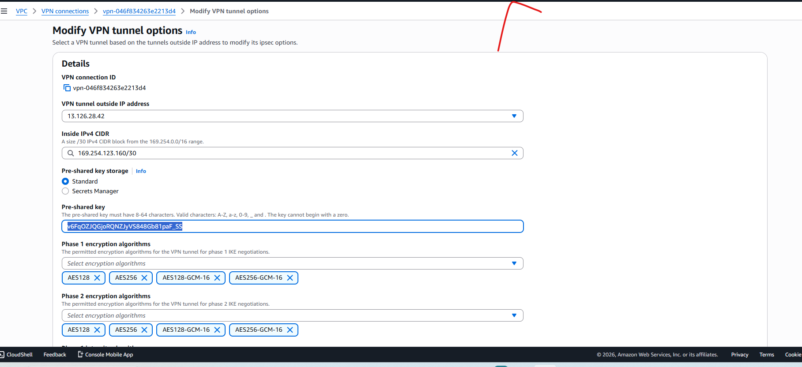


## Check vpn tunneling configuration status in aws if UP tunneling connection is working.
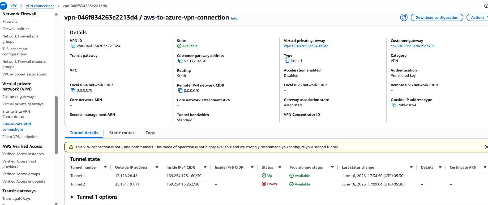

## Creat Virtual machines on AWS and Azure, with respective of vpc and allow the ports in security groups and do tunneling ping wiseversa
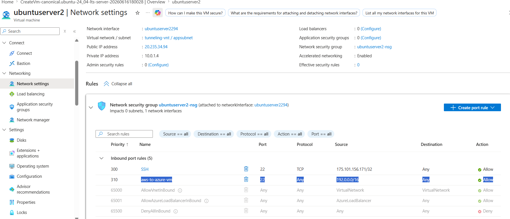

### Telnet azure vm private ip with port 22 in aws.
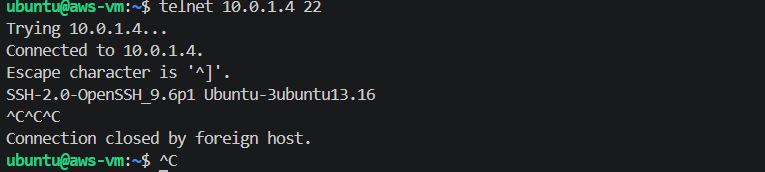
Note:-

```bash
    Allow 22 port with aws vpc cidr range inthe azure vm network security groups
```

### Telnet aws vm private ip with port 22 in azure 
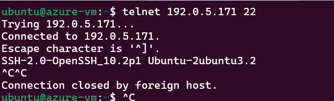

Note:-

```bash
    Allow 22 port with azure vpc cidr range inthe aws vm network security groups
```


